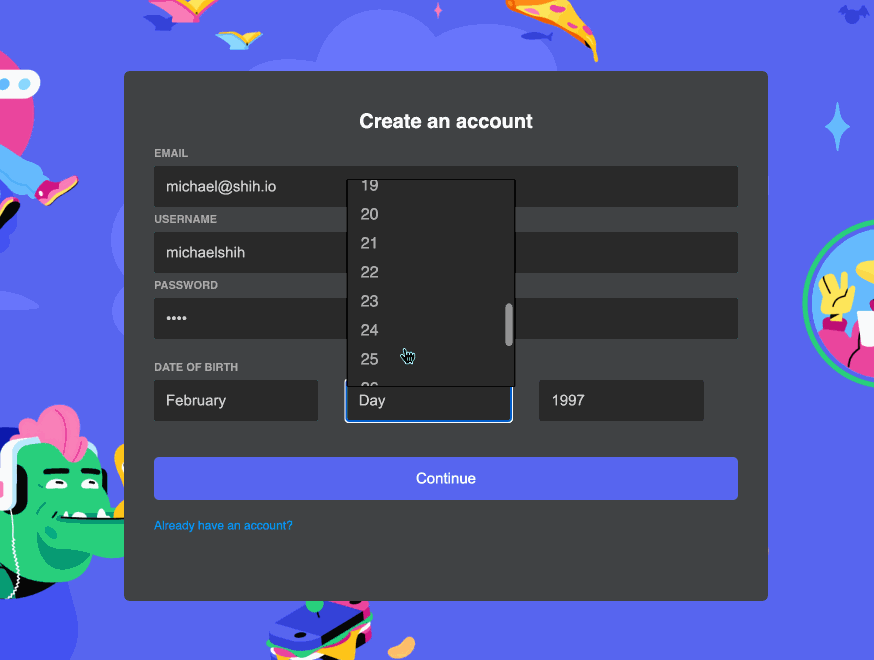
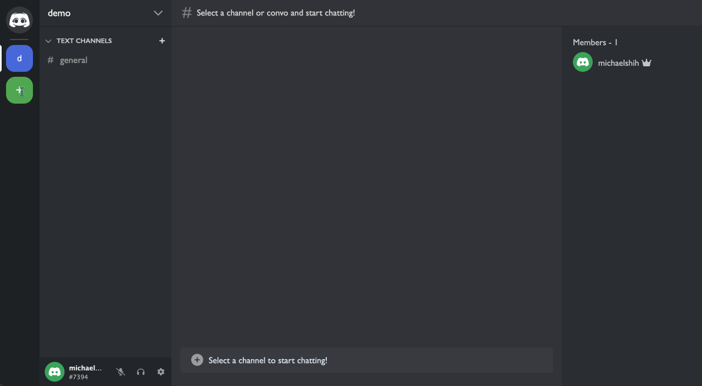
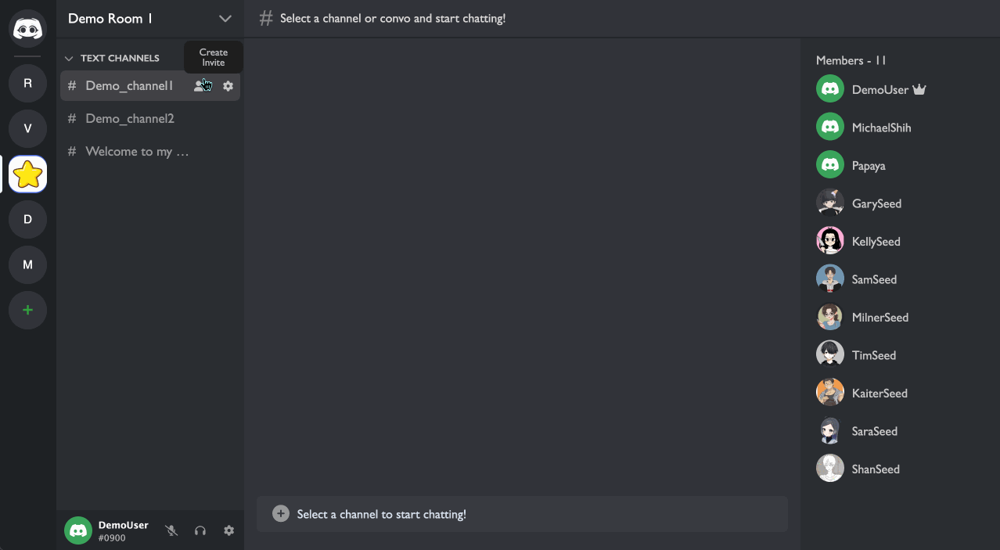
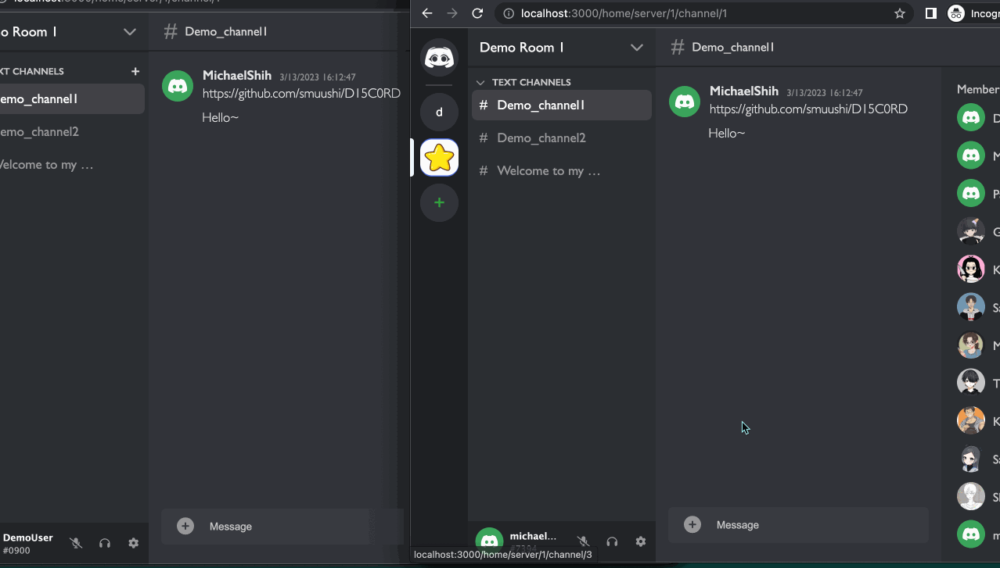

# D15C0RD README

[Live Link](https://d15c0rd.onrender.com)

### About

D15C0RD is a clone of the chat-application, Discord. The clone uses a full stack architecture to recreate the main functionality of the application. The main features include, user authentication, live-chat messaging, server and channel management, as well as account profile management. 

A user can sign up for a brand new account and log in to begin making a server and channel. After that creation, the user can create invites to invite other users to the server. My main interest in the original Discord app was the functionality behind live messaging and dynamic server invites. As such, this clone features websockets for live-chatting, AWS image hosting for sending images with messages, and backend logic to create, verify, and destroy invites for servers. More details below. 

Technology Overview: 
* Languages: Javascript, Ruby, HTML, CSS, SQL 
* Frontend: React w/ Redux global state management
* Backend: Ruby On Rails
* Database: PostgreSQL
* Hosting w/ Render
* AWS S3 Image Hosting and Storage

### Architecture Overview and Takeaways

This project was done within a 14 day timeframe. As an exercise and learning opportunity, I gained a lot of experience by engineering an application that incorporated so many interacting parts and components in a live fullstack HTTP-request environment. 

In short, D15C0RD was particularly useful for learning how and why websockets, AWS, and ReactJS are powerful tools. Websockets are vital for live features and keeping the end-user accessible to the backend for live updates. AWS is a powerful platform for managing large swaths of data that would normally be too cumbersome for a local machine to hold. Although requiring a lot of configuration for Rails involving customizing .env files and being mindful of sensitive API access keys, the end result is a way for me as a developer to be more versatile and flexible. For that reason, AWS deserves a ton of respect and effort to learn well! And experience working with the React framework to create functional frontend components that build into a full application was invaluable. 

Although object-oriented programming was my first programming paradigm, D15C0RD introduced and trained me in the functional and procedural programming paradigm. In particular, learning how data can flow between the functional components freely and how to manage and build systems around that freedom was a challenge. The challenge mainly stemmed from learning how to prioritize and be cognisant about consistency in datatypes and data manipulations. 

For instance, passing an integer from a component into a thunk, while extremely fluid and efficient in state management, required that I be mindful of how I use that integer. Forgetting that my datatype was an integer later and trying to pass an array or object would result in a loud bug. From this, I learned how to be proficient in debugging within the functional and procedurla programing paradigm. 

This project felt unique in its learning experience in that Ruby's strong OOP lean made it so that I had to learn how to reconcile two different approaches to programming in order to solve the engineering problems around live-chat, user auth, and CRUD functionality. 

As the main takeaway, I'd do this project again. I had fun overcoming new and unique challenges!

# MVPs

## User Authentication 

A user can sign up for a new account that will persist new account credentials to the backend database!

- Additionally, there is errorhandling for password requirements and valid dates! (ie. Feb 23rd is an invalid date)



## Server CRUD functionality

A user can the following regarding server entities:

- Create a new server
- View existing servers
- Update their created servers
- Delete their server

    - Server Icons are communicated and stored to AWS!



Custom fetch request to utilize a FormData entity


```javascript
    export const updateServer = (serverInfo) => async (dispatch) => {

        const formData = new FormData();


        if (serverInfo.name){
            formData.append('server[name]', serverInfo.name);
        }
        formData.append('server[icon]', serverInfo.icon);
        
        const res = await csrfFetch(`/api/servers/${serverInfo.id}`,{ 
            method: 'PATCH', 
            body: formData
        });

        if (res.ok) {
            let responseInfo = await res.json();
            dispatch(receiveServer(responseInfo));
            return res;
        }  
    } 

```

## Server Invites

A user can create invites to their servers. 

A given server `has_many` invites associated with it. A user can call the backend to create a new associated invite and return an invite code. Other users can use that invite to join a server. This is done by having the joining other user call the backend, passing along their ID and the invite code. The backend will then verify and validate the invite. Only after that validation, the backend will create a new associated server membership/subscription for the joining user. 



See the code below for creating a new server_subscription for a requesting joining user

#### Outgoing Thunk
```javascript

    export const joinServer = (request) => async (dispatch) => {

        const res = await csrfFetch(`/api/server_subscriptions`, {
            method: 'POST',
            body: JSON.stringify({
                subrequest: {
                    ...request
                }
            })
        });

        if (res.ok) {
            let data = await res.json();

            dispatch(receiveServer(data));
            dispatch(addNewServerToJoinedServers({subscriberId: request.subscriberId, serverId: data.id}));
            return data;
            
        } else {

            let errorArray = await res.json();

            // console.log("failed to join server");
            dispatch(receiveError(errorArray));

            throw new Error;
        }

    }

```

#### Receiving Controller Action
```ruby
  def create

    @invite_code = Invite.includes(:server).find_by(invite_code: server_subscription_params[:invite])

    if @invite_code
      server_id = @invite_code.server.id

      @server = @invite_code.server
      
      @server_subscription = ServerSubscription.new(
        subscriber_id: server_subscription_params[:subscriber_id],
         server_id: server_id)
      
      if @server_subscription.save

        ServerChannel.broadcast_to(@server, {type: "joining", body: @server.subscribers.ids})

        render "api/servers/show", status: :created 
      else
        render json: @server_subscription.errors.full_messages, status: 469

      end

    else
      render json: ["invite is so invalid it hurts... oh god"], status: 469
    end
  end

```

## Live Chat

The challenge of livechatting involves asking ourselves, "how do we keep the end-user up-to-date with new database changes without having them call our backend?" To solve this, we program a websocket that creates a channel that will listen for changes. This means we essentially have 3 baseline requirements to programming a functional websocket for our application. 

1. A way to establish a connection/channel
2. What do with the data coming to the user from the connection/channel
3. How and when do we send data from our backend through the connection/channel. 

Fortunately, React and Rails has a ton of available documentation on how to accomplish those three requirements, and it's only up to the developer to decide when the send the data and what to do with it. For D15C0RD, my main use-case was to keep the end-user updated on any message changes for any messages they're currently seeing (in addition to other smaller cases like seeing when others join the server, new channels for the server they're currently seeing, etc.).




Establishing the websocket on mount for the MessageLog component. 

```javascript

    useEffect(() => {

            const webSocket = consumer.subscriptions.create({
                channel: "ChannelChannel", 
                channel_id: currentChannelId 
            },
            {
                received: updateMessageLog
            })

        return () => webSocket?.unsubscribe()

    },[currentChannelId])


```

The callback that's called when the websocket `received` some data. 

```javascript
    const updateMessageLog = (broadcast) => {

        if(broadcast.message) {
            let newMessageInfo = broadcast.message;
            newMessageInfo.picture = broadcast.picture;
            dispatch(receiveMessageInfo(newMessageInfo))
        }

        if (broadcast.message_list) {
            const newMessageIdsToRender = broadcast?.message_list;
            const channelUpdate = ({
                channelId: currentChannelId, 
                messageList: newMessageIdsToRender
            })
            dispatch(updateMessageList(channelUpdate))
        }

        if (broadcast.message_update) {
            const messageInfo = broadcast?.message_update;
            dispatch(receiveMessageInfo(messageInfo))
        }

    }
```


## Thanks to my cohortmates and TAs for support and guidance throughout.
### I loved working together, learning as much as I could from each other, and helping everyone debug!
